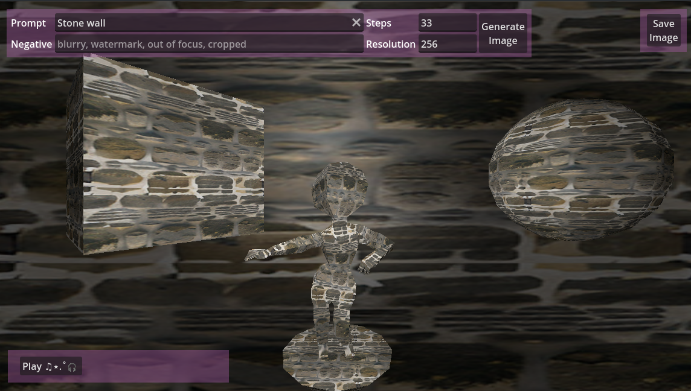
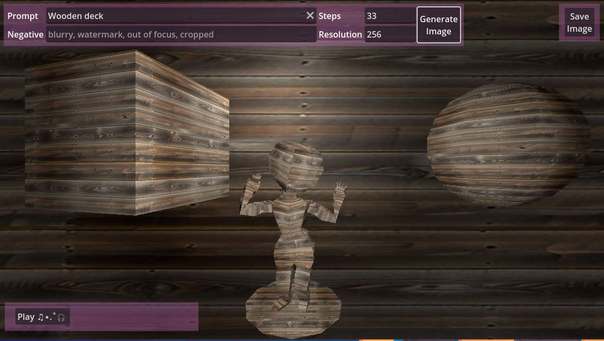

# WW!

This is a small godot project to use a local install of automatic1111 to generate seamless image tiles and then uses them in godot.

# Credits 

Music by <a href="https://pixabay.com/users/robloxeur-43206746/?utm_source=link-attribution&utm_medium=referral&utm_campaign=music&utm_content=245142">Mika Dupuis</a> from <a href="https://pixabay.com/music//?utm_source=link-attribution&utm_medium=referral&utm_campaign=music&utm_content=245142">Pixabay</a>

