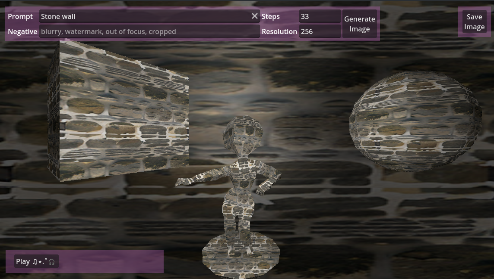
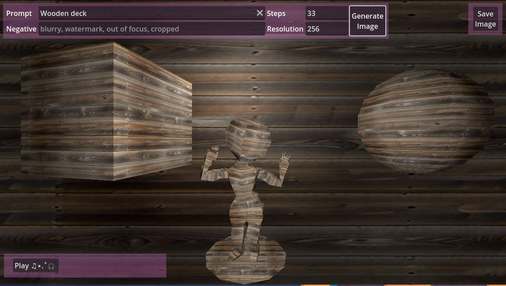
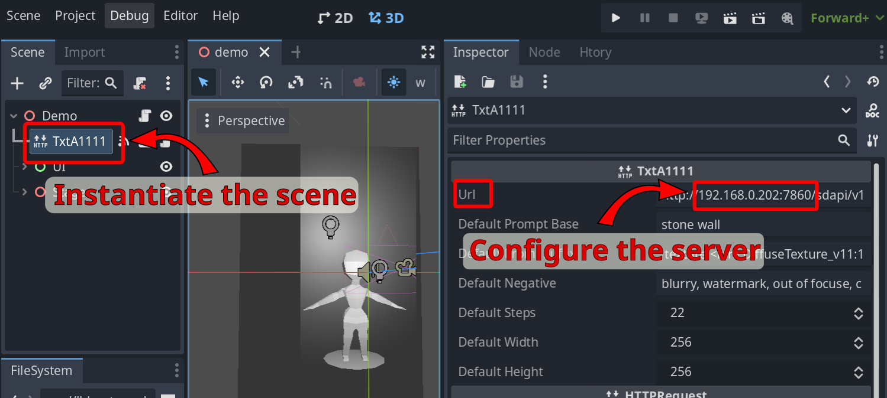
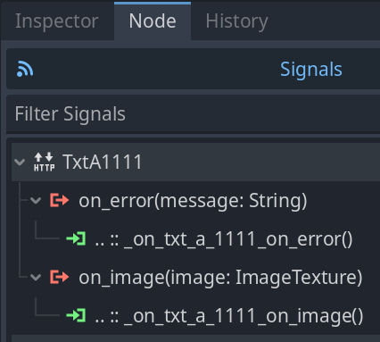

# [Seamless Dynamic ]T[e]xt[ures via]A[utomatic]1111

This is a small [Godot](https://godotengine.org/) project that uses a local installation of [Automatic1111](https://github.com/AUTOMATIC1111/stable-diffusion-webui) to generate seamless image tiles and then uses them in as [ImageTexture](https://docs.godotengine.org/en/stable/classes/class_imagetexture.html)s.

## Demo Scene

https://github.com/loose-bit-labs/txta1111/raw/refs/heads/main/web/txta1111-twitted.mp4



# Using the TxtA1111 Scene in a Project

## Configuration

Instantiate it into your scene and configure the server url:



## Connect the Signals



The signatures are something like this:

```
func _on_txt_a_1111_on_image(image: ImageTexture) -> void:
    pass

func _on_txt_a_1111_on_error(_message: String) -> void:
	pass
```

See [demo.gd#L52-L66](https://github.com/loose-bit-labs/txta1111/blob/83766887265a00b29be927bdb27ae64b9ed1de6b/scenes/demo/demo.gd#L52-L66) for an example.

# Automatic1111 Setup

For local [Automatic1111](https://github.com/AUTOMATIC1111/stable-diffusion-webui) I use:

* [Realistic Vision V6.0 B1](https://civitai.com/models/4201/realistic-vision-v60-b1) by [SG_161222](https://civitai.com/user/SG_161222)
* [Diffuse Texture](https://civitai.com/models/50391?modelVersionId=100006) Lora by [DigitalDreamer](https://civitai.com/user/DigitalDreamer)

# Music Credits 
Music by [Mika Dupuis](https://pixabay.com/users/robloxeur-43206746/?utm_source=link-attribution&utm_medium=referral&utm_campaign=music&utm_content=245142) from [Pixabay](https://pixabay.com/music//?utm_source=link-attribution&utm_medium=referral&utm_campaign=music&utm_content=245142)
